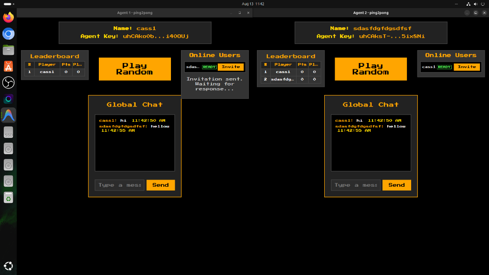
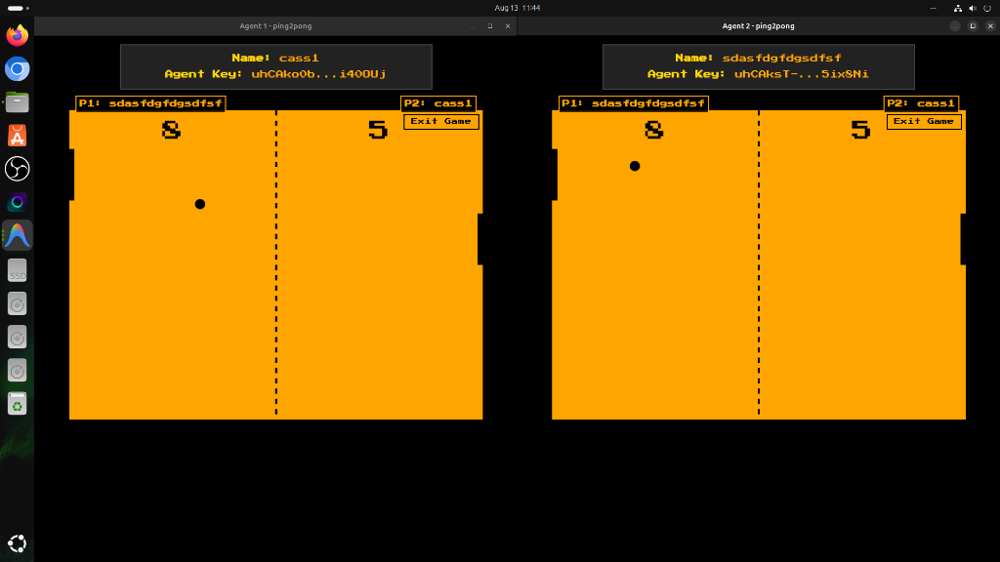
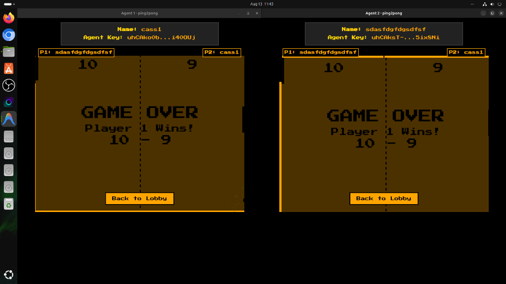
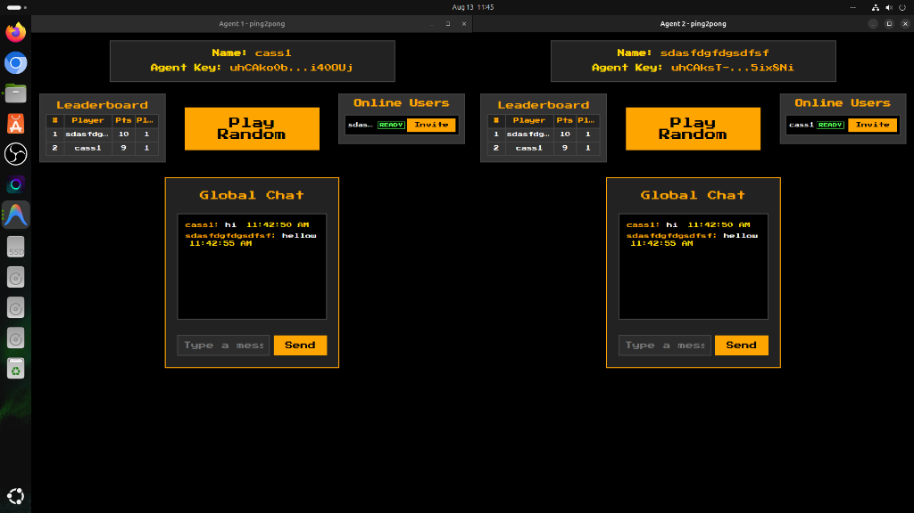

# 🏓 Ping2Pong

**Ping2Pong** is a decentralized, peer-to-peer multiplayer Pong arcade game built on **Holochain 0.7** (`HDI 0.8` / `HDK 0.7`) and **Kitsune2 / Iroh P2P networking**.

It was built as a **Proof of Concept (PoC)** to explore and demonstrate the limits of **high-frequency ephemeral signals (`call_remote`)** in Holochain for real-time arcade game physics without central servers or third-party relay infrastructure.

> 💡 **100% Native Holochain Full-Stack**:
> This project uses **pure, unadulterated Holochain**. There are **zero workarounds**, zero central WebSockets servers, zero Firebase/Supabase relay databases, and zero external signaling daemons. All presence, invitations, real-time paddle/ball signals, global chat, player profiles, score validation, and leaderboard rankings run natively through Holochain WASM zomes and Kitsune2 P2P transport.

---

## 📸 Screenshots

### 1. Multi-Agent Lobby & Real-Time P2P Chat
Real-time player presence publishing, instant peer-to-peer game invitations, and global chat over Holochain signals.


### 2. Real-Time P2P Gameplay
Direct 50fps signal streaming (`PaddleUpdate`, `BallUpdate`, `PaddleHit`) between peer conductors over Kitsune2 WebSockets.


### 3. Match Finish & Synchronized Game Over Results
Automated victory/defeat modal popups with synchronized final score states delivered to both peers.


### 4. DHT Leaderboard & Persistent Scores
Immutable score creation validated by integrity zomes and aggregated on the P2P DHT.


---

## 🌟 Key Technical Features

- **100% Decentralized P2P Stack**: Built on Holochain 0.7 (`hdi = "=0.8.0"`, `hdk = "=0.7.0"`). No central servers or databases required.
- **Direct Ephemeral Signals (`call_remote`)**: Bypasses DHT storage for high-frequency real-time physics (`PaddleUpdate`, `BallUpdate`, `PaddleHit`, `ScoreUpdate`, `GameOver`) directly between peer conductors.
- **Unrestricted Capability Grants (`pub fn init`)**: Public WASM entrypoint grants global `CapAccess::Unrestricted` for seamless cross-agent signal exchange.
- **50fps High-Frequency Sync & Lag Compensation**:
  - **20ms Signal Interval**: Transmits 50 updates per second during active motion tracking.
  - **Trailing Stop Sync**: Guaranteed final-position signal delivery on key release so paddle positions remain locked across peers.
  - **18px Hitbox Grace Margin**: Expands paddle hitboxes vertically by 18px to absorb cross-continent P2P latency smoothly.
  - **Authoritative `PaddleHit` Signal**: Instant local deflection feedback ensures defenders are never penalized for last-second saves.
- **Global Lobby & Presence**: Real-time presence publishing with online state badges (`READY`, `PLAYING`).
- **Global P2P Chat**: Integrated real-time global chat room powered by ephemeral signals.
- **Moss & Holochain Launcher Ready**: Includes a 1024x1024 pixel-art `icon.png` and standard Moss `.webhapp` packaging.

---

## 🚀 Quick Start (Development)

### Prerequisites

Ensure you have the [Holochain Development Environment](https://developer.holochain.org/docs/install/) installed.

### Enter Nix Environment & Install Dependencies

```bash
nix develop
npm install
```

### Launch 2-Agent Multi-Window Sandbox

```bash
npm run start
```

This compiles the WASM zomes, packages the `.webhapp` application, and launches 2 connected Holochain conductors (`hc-spin`) with independent UI client windows.

---

## 📦 Building & Packaging for Production / Moss

To package the application into a `.webhapp` distribution file for **Moss** or **Holochain Launcher**:

```bash
npm run package
```

The resulting package will be generated at:
- `workdir/ping2pong.webhapp`

---

## 🛠️ Architecture & Tech Stack

- **Holochain HDK**: `=0.7.0`
- **Holochain HDI**: `=0.8.0`
- **Networking**: Kitsune2 / Iroh WebSockets
- **Frontend**: Svelte + TypeScript + Vite + HTML5 Canvas
- **State Management**: Reactive Svelte Stores (`profilesCache`, `chatStore`, `currentGame`)
